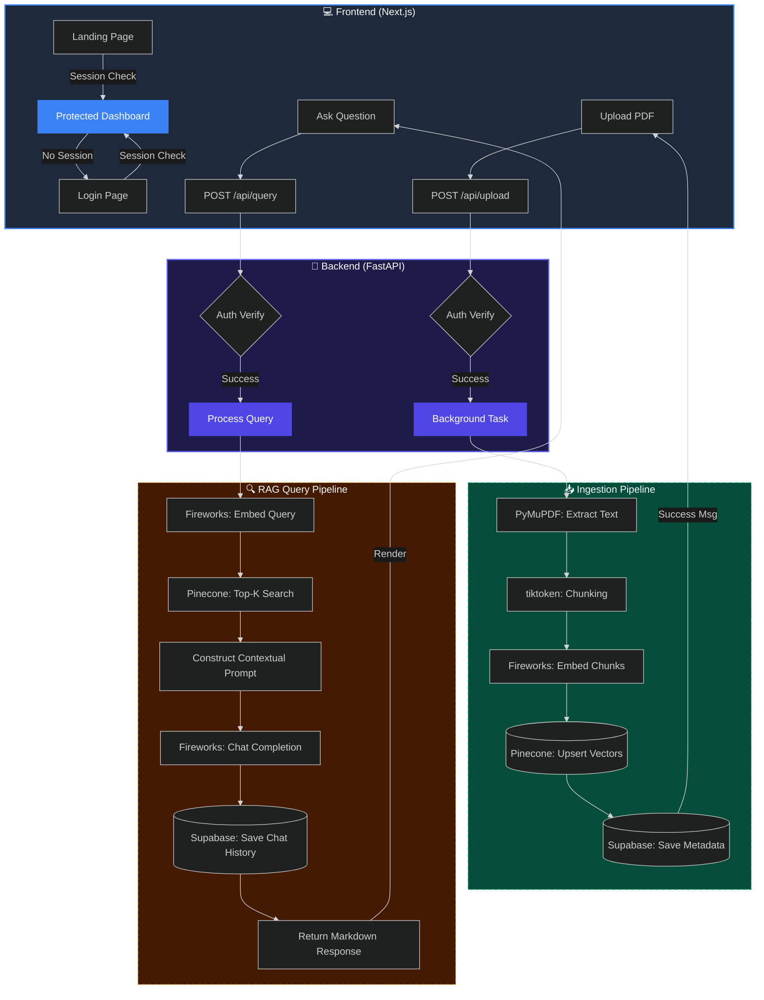

# 📊 StudyBrain Architecture Diagram

This diagram visualizes the data flow for both **Document Ingestion** and **RAG Query** pipelines, optimized for dark mode.

---

## 🎨 How to view this diagram:
1.  **GitHub**: Renders automatically and looks best in GitHub's **Dark Mode**.
2.  **VS Code**: Install the "Markdown Preview Mermaid Support" extension.
3.  **Online**: Copy the code block above and paste it into the [Mermaid Live Editor](https://mermaid.live/).

---

### 📝 Flow Summary:
*   **App-Style Layout**: Root level `h-screen` and `overflow-hidden` ensures a stable viewport where only content scrolls.
*   **Responsive Nav**: Tab labels are conditionally rendered based on viewport width (`sm:inline`).
*   **Green Path (Ingestion)**: Heavy processing is offloaded to background tasks to keep the UI snappy.
*   **Gold Path (Query)**: Real-time retrieval and generation.
*   **Red Gateway**: Security layer validating every request using Supabase JWT.
